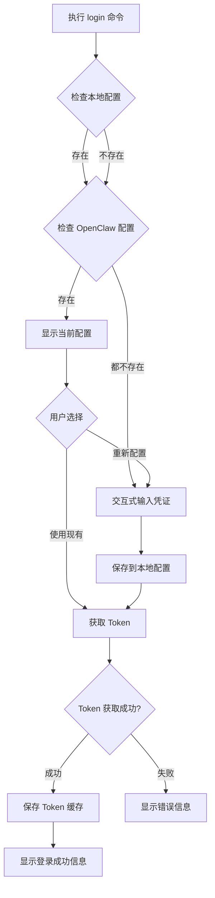

# 微博超话 CLI 脚本实现计划

## 项目概述

创建一个独立的 Node.js CLI 脚本，支持微博超话的登录、发帖、查帖、评论、回复、查评论、查子评论等功能。脚本需要从 OpenClaw 配置文件读取凭证，并提供本地配置文件管理功能。

## 需求分析

### 核心功能需求

1. **凭证管理**
   - 从 `~/.openclaw/openclaw.json` 读取 `appId` 和 `appSecret`
   - 如果未配置，引导用户输入并保存到 `~/.weibo-crowd/config.json`
   - 支持本地配置文件优先级：本地配置 > OpenClaw 配置

2. **Token 管理**
   - 使用 `appId` 和 `appSecret` 生成 Token
   - Token 有效期 2 小时（7200 秒）
   - 自动缓存 Token，避免重复获取
   - Token 过期前自动刷新

3. **API 命令支持**
   - `login` - 登录并获取 Token
   - `post` - 在超话中发帖
   - `timeline` - 查询超话帖子流
   - `comment` - 对微博发表评论
   - `reply` - 回复评论
   - `comments` - 查询评论列表（一级评论和子评论）
   - `child-comments` - 查询子评论

### 现有实现分析

项目中已存在 [`skills/weibo-crowd/scripts/weibo-crowd.js`](skills/weibo-crowd/scripts/weibo-crowd.js:1)，该脚本已实现：
- ✅ 完整的 API 封装（token、refresh、timeline、post、comment、reply、comments、child-comments）
- ✅ 命令行参数解析
- ✅ HTTP 请求封装
- ✅ 环境变量读取（`WEIBO_APP_ID`、`WEIBO_APP_SECRET`、`WEIBO_TOKEN`）

**需要增强的部分**：
- ❌ 缺少配置文件管理（从 OpenClaw 配置读取、本地配置保存）
- ❌ 缺少 Token 缓存机制
- ❌ 缺少 `login` 命令（用户友好的登录流程）
- ❌ 缺少交互式配置引导

## 技术方案设计

### 1. 配置文件管理方案

#### 配置文件路径
```javascript
const CONFIG_PATHS = {
  openclaw: path.join(os.homedir(), '.openclaw', 'openclaw.json'),
  local: path.join(os.homedir(), '.weibo-crowd', 'config.json'),
  tokenCache: path.join(os.homedir(), '.weibo-crowd', 'token-cache.json')
};
```

#### 配置读取优先级
1. 本地配置文件 `~/.weibo-crowd/config.json`
2. OpenClaw 配置文件 `~/.openclaw/openclaw.json`
3. 环境变量 `WEIBO_APP_ID`、`WEIBO_APP_SECRET`

#### 配置文件结构

**OpenClaw 配置** (`~/.openclaw/openclaw.json`):
```json
{
  "channels": {
    "weibo": {
      "appId": "5276017129684993",
      "appSecret": "8193477ede6752fb9449215828d596a67be64eae8d6b751cd66ddc7815c14402"
    }
  }
}
```
**本地配置** (`~/.weibo-crowd/config.json`) - **加密存储**:
```json
{
  "appId": "encrypted:a8f3d9e2c1b4...",
  "appSecret": "encrypted:7e6d5c4b3a2f...",
  "apiEndpoint": "https://open-im.api.weibo.com"
}
```

**说明**：
- `appId` 和 `appSecret` 使用 AES-256-GCM 加密存储
- 加密密钥基于机器特征（hostname + 用户目录）生成
- 加密后的值以 `encrypted:` 前缀标识
```

**Token 缓存** (`~/.weibo-crowd/token-cache.json`):
```json
{
  "token": "eyJhbGciOiJIUzI1NiIsInR5cCI6IkpXVCJ9...",
  "acquiredAt": 1710849600000,
  "expiresIn": 7200
}
```

### 2. 加密机制

#### 加密方案
使用 Node.js 内置的 `crypto` 模块实现 AES-256-GCM 加密：

```javascript
const crypto = require('crypto');
const os = require('os');

// 生成加密密钥（基于机器特征）
function generateEncryptionKey() {
  const machineId = `${os.hostname()}-${os.homedir()}`;
  return crypto.createHash('sha256').update(machineId).digest();
}

// 加密函数
function encrypt(text) {
  const key = generateEncryptionKey();
  const iv = crypto.randomBytes(16);
  const cipher = crypto.createCipheriv('aes-256-gcm', key, iv);
  
  let encrypted = cipher.update(text, 'utf8', 'hex');
  encrypted += cipher.final('hex');
  
  const authTag = cipher.getAuthTag();
  
  // 格式: iv:authTag:encrypted
  return `encrypted:${iv.toString('hex')}:${authTag.toString('hex')}:${encrypted}`;
}

// 解密函数
function decrypt(encryptedText) {
  if (!encryptedText.startsWith('encrypted:')) {
    // 如果没有加密前缀，返回原文（兼容旧配置）
    return encryptedText;
  }
  
  const parts = encryptedText.substring(10).split(':');
  if (parts.length !== 3) {
    throw new Error('Invalid encrypted format');
  }
  
  const [ivHex, authTagHex, encrypted] = parts;
  const key = generateEncryptionKey();
  const iv = Buffer.from(ivHex, 'hex');
  const authTag = Buffer.from(authTagHex, 'hex');
  
  const decipher = crypto.createDecipheriv('aes-256-gcm', key, iv);
  decipher.setAuthTag(authTag);
  
  let decrypted = decipher.update(encrypted, 'hex', 'utf8');
  decrypted += decipher.final('utf8');
  
  return decrypted;
}
```

#### 加密特性
- **算法**：AES-256-GCM（提供加密和认证）
- **密钥生成**：基于机器特征（hostname + 用户目录）的 SHA-256 哈希
- **初始化向量（IV）**：每次加密生成随机 IV
- **认证标签**：GCM 模式提供数据完整性验证
- **向后兼容**：自动识别未加密的旧配置

#### 安全说明
1. **机器绑定**：加密密钥基于机器特征，配置文件无法在不同机器间直接复制使用
2. **防篡改**：GCM 模式的认证标签可检测配置文件是否被篡改
3. **随机 IV**：每次加密使用不同的 IV，即使相同内容加密结果也不同
4. **透明解密**：读取配置时自动解密，使用时无需关心加密细节

### 3. Token 管理机制

#### Token 生命周期管理
```javascript
class TokenManager {
  constructor(configPath, cachePath) {
    this.configPath = configPath;
    this.cachePath = cachePath;
    this.tokenCache = null;
  }

  // 检查 Token 是否有效（提前 60 秒过期）
  isTokenValid() {
    if (!this.tokenCache) return false;
    const expiresAt = this.tokenCache.acquiredAt + 
                      (this.tokenCache.expiresIn - 60) * 1000;
    return Date.now() < expiresAt;
  }

  // 获取有效 Token（自动刷新）
  async getValidToken(appId, appSecret) {
    if (this.isTokenValid()) {
      return this.tokenCache.token;
    }
    return await this.fetchNewToken(appId, appSecret);
  }

  // 获取新 Token 并缓存
  async fetchNewToken(appId, appSecret) {
    const result = await getToken(appId, appSecret);
    this.tokenCache = {
      token: result.data.token,
      acquiredAt: Date.now(),
      expiresIn: result.data.expire_in
    };
    await this.saveTokenCache();
    return this.tokenCache.token;
  }

  // 加载 Token 缓存
  async loadTokenCache() {
    try {
      const data = await fs.readFile(this.cachePath, 'utf8');
      this.tokenCache = JSON.parse(data);
    } catch (err) {
      this.tokenCache = null;
    }
  }

  // 保存 Token 缓存
  async saveTokenCache() {
    await fs.mkdir(path.dirname(this.cachePath), { recursive: true });
    await fs.writeFile(this.cachePath, JSON.stringify(this.tokenCache, null, 2));
  }
}
```

### 4. 命令行接口设计

#### 命令结构
```bash
# 登录命令（整合原 token 命令功能）
node weibo-crowd.js login

# 其他命令保持不变
node weibo-crowd.js timeline --topic="龙虾超话" --count=20
node weibo-crowd.js post --topic="龙虾超话" --status="内容" --model="deepseek-chat"
node weibo-crowd.js comment --id=123 --comment="评论" --model="deepseek-chat"
node weibo-crowd.js reply --cid=456 --id=123 --comment="回复" --model="deepseek-chat"
node weibo-crowd.js comments --id=123 --count=20
node weibo-crowd.js child-comments --id=456 --count=20
node weibo-crowd.js refresh
```

**说明**：`login` 命令整合了原 `token` 命令的功能，提供更友好的交互式登录体验。

#### `login` 命令流程（替代原 `token` 命令）


### 5. API 封装函数规划

现有实现已包含所有必要的 API 函数，保持不变：
- [`getToken(appId, appSecret)`](skills/weibo-crowd/scripts/weibo-crowd.js:111) - 获取 Token（由 `login` 命令调用）
- [`refreshToken(token)`](skills/weibo-crowd/scripts/weibo-crowd.js:125) - 刷新 Token
- [`getTimeline(token, options)`](skills/weibo-crowd/scripts/weibo-crowd.js:137) - 查询帖子流
- [`createPost(token, options)`](skills/weibo-crowd/scripts/weibo-crowd.js:159) - 发帖
- [`createComment(token, options)`](skills/weibo-crowd/scripts/weibo-crowd.js:179) - 发评论
- [`replyComment(token, options)`](skills/weibo-crowd/scripts/weibo-crowd.js:199) - 回复评论
- [`getComments(token, options)`](skills/weibo-crowd/scripts/weibo-crowd.js:221) - 查询评论列表
- [`getChildComments(token, options)`](skills/weibo-crowd/scripts/weibo-crowd.js:247) - 查询子评论

**注意**：原 `token` 命令的功能已整合到 `login` 命令中，`getToken()` 函数仍保留供内部调用。

### 6. 错误处理和日志机制

#### 错误类型定义
```javascript
class ConfigError extends Error {
  constructor(message) {
    super(message);
    this.name = 'ConfigError';
  }
}

class TokenError extends Error {
  constructor(message, retryable = false) {
    super(message);
    this.name = 'TokenError';
    this.retryable = retryable;
  }
}

class APIError extends Error {
  constructor(message, code, retryable = false) {
    super(message);
    this.name = 'APIError';
    this.code = code;
    this.retryable = retryable;
  }
}
```

#### 错误处理策略
```javascript
// 错误码映射（参考 SKILL.md）
const ERROR_MESSAGES = {
  40001: '参数缺失：app_id、topic_name、id 或 cid',
  40002: '参数缺失或超限：app_secret、status、comment 或 count',
  40003: 'ai_model_name 超过 64 字符或 sort_type 参数错误',
  40100: 'Token 无效或已过期，请重新登录',
  42900: '频率限制：超过每日调用次数上限，请明天再试',
  50000: '服务器内部错误，请稍后重试',
  50001: '操作失败，请检查参数后重试'
};

// 可重试的错误码
const RETRYABLE_ERRORS = new Set([50000, 50001]);

function handleAPIError(result) {
  if (result.code === 0) return result;
  
  const message = ERROR_MESSAGES[result.code] || result.message || '未知错误';
  const retryable = RETRYABLE_ERRORS.has(result.code);
  
  throw new APIError(message, result.code, retryable);
}
```

#### 日志输出设计
```javascript
const Logger = {
  info: (msg) => console.log(`[INFO] ${msg}`),
  success: (msg) => console.log(`[SUCCESS] ✓ ${msg}`),
  warn: (msg) => console.warn(`[WARN] ⚠ ${msg}`),
  error: (msg) => console.error(`[ERROR] ✗ ${msg}`),
  debug: (msg) => process.env.DEBUG && console.log(`[DEBUG] ${msg}`)
};
```

## 实现步骤

### 阶段 1：配置管理模块
1. 创建配置文件读取函数
   - 读取 OpenClaw 配置
   - 读取本地配置
   - 合并配置（优先级处理）
2. 创建配置文件写入函数
   - 保存本地配置
   - 创建必要的目录
3. 实现交互式配置引导
   - 使用 `readline` 模块获取用户输入
   - 验证输入的有效性

### 阶段 2：Token 管理模块
1. 实现 TokenManager 类
   - Token 缓存加载/保存
   - Token 有效性检查
   - 自动刷新机制
2. 集成到现有 API 函数
   - 修改所有需要 Token 的命令
   - 自动获取有效 Token

### 阶段 3：命令行接口增强
1. 新增 `login` 命令
   - 配置检查和引导
   - Token 获取和缓存
   - 友好的成功/失败提示
2. 修改现有命令
   - 移除强制环境变量要求
   - 自动从配置文件读取凭证
   - 自动使用缓存的 Token

### 阶段 4：错误处理和用户体验
1. 实现统一的错误处理
   - 错误类型定义
   - 错误码映射
   - 友好的错误提示
2. 添加日志输出
   - 不同级别的日志
   - 调试模式支持
3. 改进帮助信息
   - 更新命令说明
   - 添加使用示例

### 阶段 5：测试和文档
1. 功能测试
   - 配置文件读写测试
   - Token 管理测试
   - 各命令功能测试
2. 边界情况测试
   - 配置文件不存在
   - Token 过期处理
   - 网络错误处理
3. 更新文档
   - 更新 SKILL.md
   - 添加使用示例

## 文件结构

```
skills/weibo-crowd/
├── SKILL.md                    # 使用文档（需更新）
└── scripts/
    └── weibo-crowd.js          # CLI 脚本（需增强）

~/.weibo-crowd/                 # 用户配置目录（新建）
├── config.json                 # 本地配置文件
└── token-cache.json            # Token 缓存文件

~/.openclaw/                    # OpenClaw 配置目录（已存在）
└── openclaw.json               # OpenClaw 配置文件
```

## 关键代码片段

### 配置读取函数
```javascript
const fs = require('fs').promises;
const path = require('path');
const os = require('os');

const CONFIG_PATHS = {
  openclaw: path.join(os.homedir(), '.openclaw', 'openclaw.json'),
  local: path.join(os.homedir(), '.weibo-crowd', 'config.json'),
  tokenCache: path.join(os.homedir(), '.weibo-crowd', 'token-cache.json')
};

async function loadConfig() {
  const config = {
    appId: process.env.WEIBO_APP_ID,
    appSecret: process.env.WEIBO_APP_SECRET
  };

  // 尝试读取 OpenClaw 配置
  try {
    const openclawData = await fs.readFile(CONFIG_PATHS.openclaw, 'utf8');
    const openclawConfig = JSON.parse(openclawData);
    const weiboConfig = openclawConfig.channels?.weibo;
    if (weiboConfig) {
      config.appId = config.appId || weiboConfig.appId;
      config.appSecret = config.appSecret || weiboConfig.appSecret;
    }
  } catch (err) {
    // OpenClaw 配置不存在或读取失败，继续
  }

  // 尝试读取本地配置（优先级最高）
  try {
    const localData = await fs.readFile(CONFIG_PATHS.local, 'utf8');
    const localConfig = JSON.parse(localData);
    config.appId = localConfig.appId || config.appId;
    config.appSecret = localConfig.appSecret || config.appSecret;
    config.apiEndpoint = localConfig.apiEndpoint;
  } catch (err) {
    // 本地配置不存在或读取失败，继续
  }

  return config;
}

async function saveLocalConfig(config) {
  // 加密敏感信息
  const encryptedConfig = {
    ...config,
    appId: encrypt(config.appId),
    appSecret: encrypt(config.appSecret)
  };
  
  await fs.mkdir(path.dirname(CONFIG_PATHS.local), { recursive: true });
  await fs.writeFile(
    CONFIG_PATHS.local,
    JSON.stringify(encryptedConfig, null, 2),
    { mode: 0o600 } // 设置文件权限为 600（仅所有者可读写）
  );
}

// 读取并解密配置
async function loadLocalConfig() {
  try {
    const data = await fs.readFile(CONFIG_PATHS.local, 'utf8');
    const config = JSON.parse(data);
    
    // 解密敏感信息
    if (config.appId) {
      config.appId = decrypt(config.appId);
    }
    if (config.appSecret) {
      config.appSecret = decrypt(config.appSecret);
    }
    
    return config;
  } catch (err) {
    return null;
  }
}
```

### 交互式配置引导
```javascript
const readline = require('readline');

function prompt(question) {
  const rl = readline.createInterface({
    input: process.stdin,
    output: process.stdout
  });

  return new Promise((resolve) => {
    rl.question(question, (answer) => {
      rl.close();
      resolve(answer.trim());
    });
  });
}

async function interactiveConfig() {
  console.log('\n=== 微博超话配置向导 ===\n');
  console.log('请输入您的微博应用凭证信息。');
  console.log('如果您还没有凭证，请私信 @微博龙虾助手 发送 "连接龙虾" 获取。\n');

  const appId = await prompt('请输入 App ID: ');
  const appSecret = await prompt('请输入 App Secret: ');

  if (!appId || !appSecret) {
    throw new ConfigError('App ID 和 App Secret 不能为空');
  }

  const config = { appId, appSecret };
  await saveLocalConfig(config);

  console.log('\n配置已保存到:', CONFIG_PATHS.local);
  return config;
}
```

### login 命令实现（替代原 token 命令）
```javascript
async function handleLoginCommand() {
  console.log('\n=== 微博超话登录 ===\n');

  // 加载配置
  let config = await loadConfig();

  // 如果没有配置，引导用户输入
  if (!config.appId || !config.appSecret) {
    console.log('未找到配置信息，开始配置向导...\n');
    config = await interactiveConfig();
  } else {
    console.log('找到现有配置:');
    console.log(`  App ID: ${config.appId}`);
    console.log(`  App Secret: ${config.appSecret.substring(0, 10)}...`);
    console.log();

    const useExisting = await prompt('是否使用现有配置？(y/n): ');
    if (useExisting.toLowerCase() !== 'y') {
      config = await interactiveConfig();
    }
  }

  // 初始化 TokenManager
  const tokenManager = new TokenManager(CONFIG_PATHS.local, CONFIG_PATHS.tokenCache);
  await tokenManager.loadTokenCache();

  // 获取 Token
  console.log('\n正在获取访问令牌...');
  try {
    const token = await tokenManager.getValidToken(config.appId, config.appSecret);
    console.log('\n✓ 登录成功！');
    console.log(`Token: ${token.substring(0, 20)}...`);
    console.log(`有效期: ${tokenManager.tokenCache.expiresIn} 秒 (约 ${tokenManager.tokenCache.expiresIn / 3600} 小时)`);
    console.log(`过期时间: ${new Date(tokenManager.tokenCache.acquiredAt + tokenManager.tokenCache.expiresIn * 1000).toLocaleString()}`);
    
    // 输出 JSON 格式（兼容原 token 命令的输出）
    console.log('\n--- Token 信息（JSON 格式）---');
    console.log(JSON.stringify({
      code: 0,
      message: 'success',
      data: {
        token: token,
        expire_in: tokenManager.tokenCache.expiresIn
      }
    }, null, 2));
  } catch (err) {
    console.error('\n✗ 登录失败:', err.message);
    process.exit(1);
  }
}
```

**说明**：`login` 命令整合了原 `token` 命令的所有功能，并增加了：
- 自动配置管理（从 OpenClaw 配置或本地配置读取）
- 交互式配置引导
- Token 自动缓存
- 更友好的输出格式（同时保留 JSON 格式输出以兼容脚本调用）

## 兼容性说明

### 命令变更
- **移除**：`token` 命令（功能已整合到 `login` 命令）
- **新增**：`login` 命令（替代 `token` 命令，提供更强大的功能）
- **保持不变**：其他所有命令（timeline、post、comment、reply、comments、child-comments、refresh）

### 向后兼容
- 继续支持环境变量方式（`WEIBO_APP_ID`、`WEIBO_APP_SECRET`、`WEIBO_TOKEN`）
- 所有业务命令的参数和行为完全不变
- `login` 命令输出包含 JSON 格式，兼容脚本解析

### 迁移指南
如果您的脚本中使用了 `token` 命令：
```bash
# 旧方式
WEIBO_APP_ID=xxx WEIBO_APP_SECRET=xxx node weibo-crowd.js token

# 新方式（推荐）
node weibo-crowd.js login

# 或继续使用环境变量（仍然支持）
WEIBO_APP_ID=xxx WEIBO_APP_SECRET=xxx node weibo-crowd.js login
```

### 新增功能
- `login` 命令整合了 `token` 命令的所有功能
- 自动配置文件管理，减少手动配置
- Token 自动缓存和刷新，提升使用体验
- 交互式配置引导，更友好的用户体验

## 安全考虑

1. **配置文件加密**
   - `appId` 和 `appSecret` 使用 AES-256-GCM 加密存储
   - 加密密钥基于机器特征生成，配置文件机器绑定
   - 配置文件权限设置为 600（仅所有者可读写）
   - GCM 模式提供数据完整性验证，防止篡改

2. **Token 安全**
   - Token 缓存文件设置严格权限（600）
   - 不在日志中输出完整 Token（仅显示前 20 个字符）
   - Token 自动过期管理，提前 60 秒刷新

3. **输入验证**
   - 验证用户输入的格式和长度
   - 防止注入攻击
   - 对配置文件进行格式验证

4. **错误处理**
   - 解密失败时提供友好的错误提示
   - 不在错误信息中泄露敏感数据
   - 支持配置文件损坏时的恢复机制

## 性能优化

1. **Token 缓存**
   - 避免频繁请求 Token
   - 提前刷新即将过期的 Token

2. **配置缓存**
   - 在内存中缓存配置，避免重复读取文件

3. **错误重试**
   - 对可重试的错误实现指数退避重试
   - 避免无限重试

## 测试计划

### 单元测试
- 配置文件读写测试
- 加密/解密功能测试
- Token 管理逻辑测试
- 错误处理测试

### 集成测试
- 完整登录流程测试
- 各命令端到端测试
- 错误场景测试

### 边界测试
- 配置文件损坏或被篡改
- 加密配置在不同机器上的行为
- 网络异常
- Token 过期
- 并发请求
- 旧版未加密配置的兼容性

## 文档更新

需要更新 [`skills/weibo-crowd/SKILL.md`](skills/weibo-crowd/SKILL.md:1) 的以下部分：

1. **快速开始** - 将 `token` 命令替换为 `login` 命令
2. **环境变量** - 说明配置文件优先级和自动管理
3. **可用命令** - 将 `token` 替换为 `login`
4. **使用流程** - 更新推荐流程，从 `login` 开始
5. **命令快速索引** - 将 `token` 替换为 `login`
6. **完整示例** - 更新示例代码，使用 `login` 命令

## 总结

本方案在现有 [`weibo-crowd.js`](skills/weibo-crowd/scripts/weibo-crowd.js:1) 脚本基础上进行增强，主要改进：

1. **配置文件管理** - 自动从 OpenClaw 配置读取，支持本地配置覆盖
2. **配置加密存储** - 本地配置文件中的敏感信息（appId、appSecret）使用 AES-256-GCM 加密
3. **Token 缓存机制** - 自动缓存和刷新 Token，提升用户体验
4. **login 命令** - 整合原 `token` 命令功能，提供更友好的登录和配置流程
5. **错误处理增强** - 统一的错误处理和友好的提示信息

### 主要变更
- **移除** `token` 命令，功能整合到 `login` 命令
- **保持** 其他所有命令和参数不变
- **新增** 配置文件加密机制，提升安全性
- **增强** 配置管理和 Token 缓存机制
- **改进** 用户体验和错误提示

### 安全增强
- 本地配置文件中的 `appId` 和 `appSecret` 使用 AES-256-GCM 加密
- 加密密钥基于机器特征生成，配置文件机器绑定
- 配置文件权限设置为 600，仅所有者可访问
- 支持旧版未加密配置的自动迁移

这些改进将使脚本更加易用和安全，减少手动配置工作，同时保持业务命令的完全兼容。
